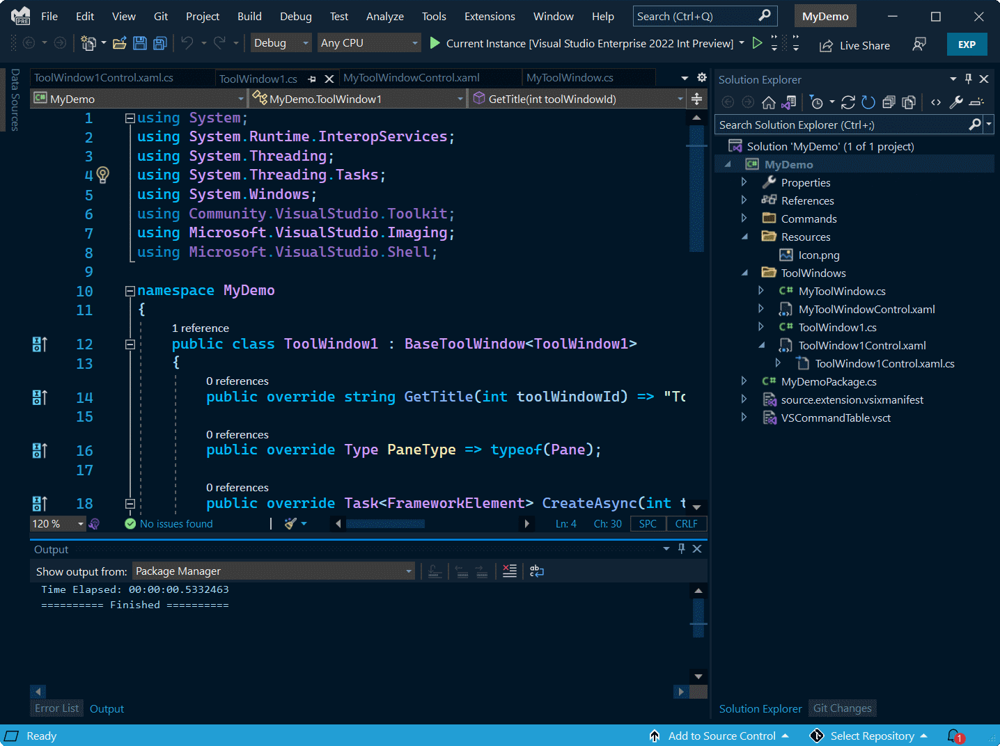
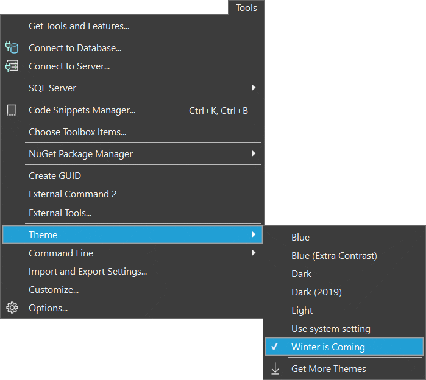

# Winter Is Coming

Download the extension at the
[Visual Studio Marketplace](https://marketplace.visualstudio.com/items?itemName=MadsKristensen.WinterIsComing)
or try the
[CI build](http://vsixgallery.com/extension/7fa839e2-b938-4b1c-9277-edaebe6fdeb5/).

---------------------------------------

A dark theme based on the popular [Winter is Coming](https://marketplace.visualstudio.com/items?itemName=johnpapa.winteriscoming) theme for VS Code. This theme was created in coorporation with the original author of the theme, [John Papa](https://twitter.com/John_Papa).

After installing the extension, the **Winter is Coming** theme becomes available in the dropdown under *Tools -> Themes*.

## License
[Apache 2.0](LICENSE)